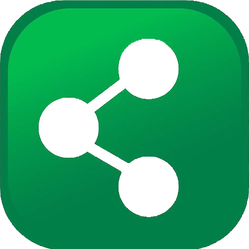

<div  id="top"><div>

<!--

*** This is the Readme for Social Media siter API Backend

-->

  

<!-- Project Shields -->

  

[![LinkedIn][linkedin-shield]][linkedin-url]

  

[](https://opensource.org/licenses/MIT)

  

<!-- Project Logo -->

<br  />

<div  align="center">

<a  href="https://young-dawn-24619.herokuapp.com/api/categories">



<br>Click the logo to launch APP<br>

<a/>

<h3  align="center">

Social Media API in No-SQL

</h3>

<p  align="center">

No-SQL powered DB API
<br  />

<a  https://github.com/aaguirre7/animated-octo-happiness">

<strong>Explore the docs</strong>

</a>

<br  />

<br  />

</div>

  

<!-- TABLE OF CONTENTS -->

<details>

<summary>Table of Contents</summary>

<ol>

<li>

<a  href="#about-the-project">About The Project</a>

</li>

<li>

<a  href="#what-was-done"> What was done</a>

</li>

<li>

<a  href="#instalation"> instalation</a>

</li>

<li>

<a  href="#usage"> usage</a>

</li>

<li>

<a  href="#contact">Contact</a>

</li>

  

</ol>

</details>

  

<!-- ABOUT THE PROJECT -->

## About The Challange

  

[![Product Name Screen Shot][product-screenshot1]](./public/assets/images/11-express-homework-demo-01.png)

  

### The Task

  


```md
AS A social media startup
I WANT an API for my social network that uses a NoSQL database
SO THAT my website can handle large amounts of unstructured data
```

  

### Criteria

  


```md
GIVEN a social network API
WHEN I enter the command to invoke the application
THEN my server is started and the Mongoose models are synced to the MongoDB database
WHEN I open API GET routes in Insomnia for users and thoughts
THEN the data for each of these routes is displayed in a formatted JSON
WHEN I test API POST, PUT, and DELETE routes in Insomnia
THEN I am able to successfully create, update, and delete users and thoughts in my database
WHEN I test API POST and DELETE routes in Insomnia
THEN I am able to successfully create and delete reactions to thoughts and add and remove friends to a user’s friend list
```
  

### What was done

  

Created a No-SQL mongodb database with routes for API and schema for the DB. APP needs a front end and can be tested using a rest API software like Insomia or Postman as shown in the project video.

  

App build in:
 

  
  
  
  


  

### Instalation

  

- Clone or Fork the Repo to your computer.

- Install NODEjs.

- Use NPM to install dependencies:

"express": "^4.18.1",

"moment": "^2.29.3",

"mongoose": "^6.3.2"

  

```

  

npm install

  

```

  

### Usage

  

Run the following from the directory where you have downloaded the repo.

  

```

  

npm start

  

```

  

this is only if you want to run this in your own deployment. the live app is currently deployed on heroku.

  

### Videos

  


  

-------------------------

Thank you for taking time looking at this page.

  

Happy painting!

  

<p  align="right">(<a  href="#top">back to top</a>)</p>

  

<!-- CONTACT -->

## Contact

  

Abraham Aguirre Aguirre.Abraham@gmail.com

  

Project Link: [https://github.com/aaguirre7/animated-octo-happiness](https://github.com/aaguirre7/bug-free-commerce)

  

<!-- MARKDOWN LINKS & IMAGES -->

[linkedin-shield]: https://img.shields.io/badge/-LinkedIn-black.svg?style=for-the-badge&logo=linkedin&colorB=555

[linkedin-url]: https://www.linkedin.com/in/abraham-aguirre-1b237293/

[product-screenshot1]: ./assets/img/screenshot_1.png

